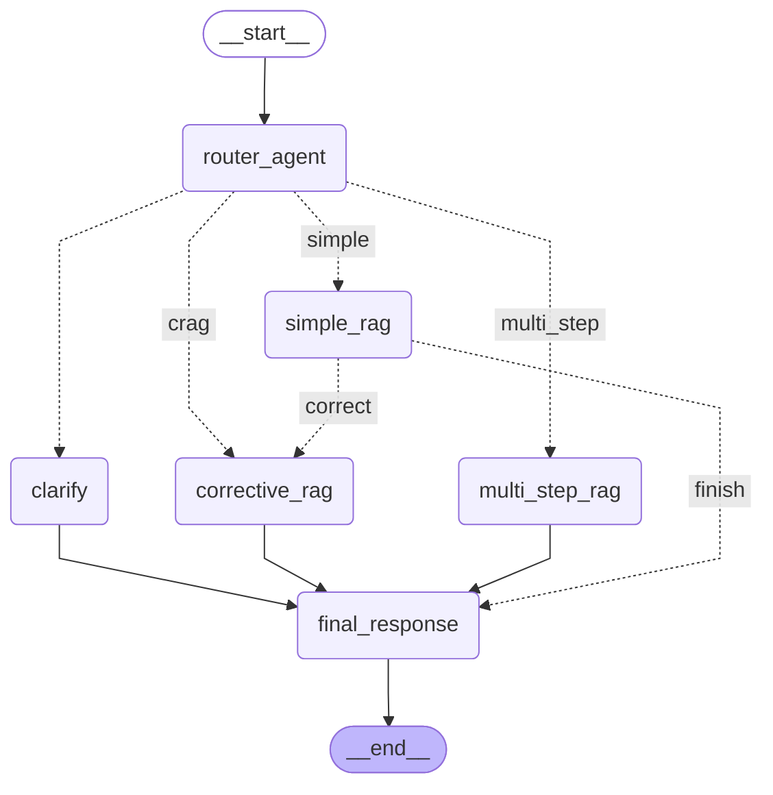
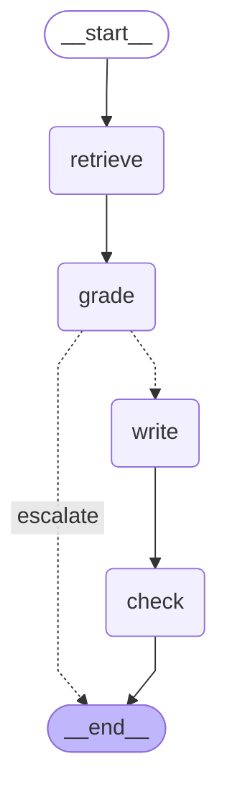
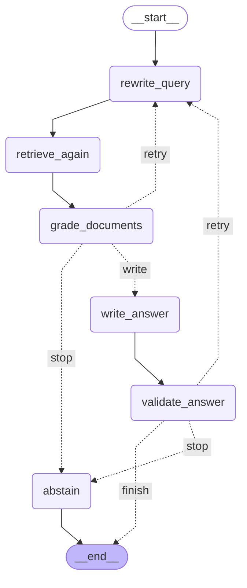
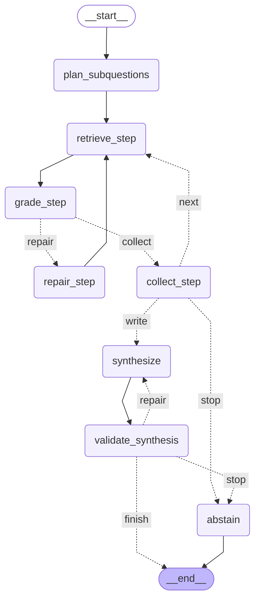

# Actual LangGraph workflows

Generated by `python scripts/export_graphs.py`; no inference or cloud calls.

## Router

```mermaid
---
config:
  flowchart:
    curve: linear
---
graph TD;
	__start__([<p>__start__</p>]):::first
	router_agent(router_agent)
	simple_rag(simple_rag)
	corrective_rag(corrective_rag)
	multi_step_rag(multi_step_rag)
	clarify(clarify)
	final_response(final_response)
	__end__([<p>__end__</p>]):::last
	__start__ --> router_agent;
	clarify --> final_response;
	corrective_rag --> final_response;
	multi_step_rag --> final_response;
	router_agent -.-> clarify;
	router_agent -. &nbsp;crag&nbsp; .-> corrective_rag;
	router_agent -. &nbsp;multi_step&nbsp; .-> multi_step_rag;
	router_agent -. &nbsp;simple&nbsp; .-> simple_rag;
	simple_rag -. &nbsp;correct&nbsp; .-> corrective_rag;
	simple_rag -. &nbsp;finish&nbsp; .-> final_response;
	final_response --> __end__;
	classDef default fill:#f2f0ff,line-height:1.2
	classDef first fill-opacity:0
	classDef last fill:#bfb6fc

```

## Simple RAG

```mermaid
---
config:
  flowchart:
    curve: linear
---
graph TD;
	__start__([<p>__start__</p>]):::first
	retrieve(retrieve)
	grade(grade)
	write(write)
	check(check)
	__end__([<p>__end__</p>]):::last
	__start__ --> retrieve;
	grade -. &nbsp;escalate&nbsp; .-> __end__;
	grade -.-> write;
	retrieve --> grade;
	write --> check;
	check --> __end__;
	classDef default fill:#f2f0ff,line-height:1.2
	classDef first fill-opacity:0
	classDef last fill:#bfb6fc

```

## Corrective RAG

```mermaid
---
config:
  flowchart:
    curve: linear
---
graph TD;
	__start__([<p>__start__</p>]):::first
	rewrite_query(rewrite_query)
	retrieve_again(retrieve_again)
	grade_documents(grade_documents)
	write_answer(write_answer)
	validate_answer(validate_answer)
	abstain(abstain)
	__end__([<p>__end__</p>]):::last
	__start__ --> rewrite_query;
	grade_documents -. &nbsp;stop&nbsp; .-> abstain;
	grade_documents -. &nbsp;retry&nbsp; .-> rewrite_query;
	grade_documents -. &nbsp;write&nbsp; .-> write_answer;
	retrieve_again --> grade_documents;
	rewrite_query --> retrieve_again;
	validate_answer -. &nbsp;finish&nbsp; .-> __end__;
	validate_answer -. &nbsp;stop&nbsp; .-> abstain;
	validate_answer -. &nbsp;retry&nbsp; .-> rewrite_query;
	write_answer --> validate_answer;
	abstain --> __end__;
	classDef default fill:#f2f0ff,line-height:1.2
	classDef first fill-opacity:0
	classDef last fill:#bfb6fc

```

## Multi-step RAG

```mermaid
---
config:
  flowchart:
    curve: linear
---
graph TD;
	__start__([<p>__start__</p>]):::first
	plan_subquestions(plan_subquestions)
	retrieve_step(retrieve_step)
	grade_step(grade_step)
	repair_step(repair_step)
	collect_step(collect_step)
	synthesize(synthesize)
	validate_synthesis(validate_synthesis)
	abstain(abstain)
	__end__([<p>__end__</p>]):::last
	__start__ --> plan_subquestions;
	collect_step -. &nbsp;stop&nbsp; .-> abstain;
	collect_step -. &nbsp;next&nbsp; .-> retrieve_step;
	collect_step -. &nbsp;write&nbsp; .-> synthesize;
	grade_step -. &nbsp;collect&nbsp; .-> collect_step;
	grade_step -. &nbsp;repair&nbsp; .-> repair_step;
	plan_subquestions --> retrieve_step;
	repair_step --> retrieve_step;
	retrieve_step --> grade_step;
	synthesize --> validate_synthesis;
	validate_synthesis -. &nbsp;finish&nbsp; .-> __end__;
	validate_synthesis -. &nbsp;stop&nbsp; .-> abstain;
	validate_synthesis -. &nbsp;repair&nbsp; .-> synthesize;
	abstain --> __end__;
	classDef default fill:#f2f0ff,line-height:1.2
	classDef first fill-opacity:0
	classDef last fill:#bfb6fc

```
